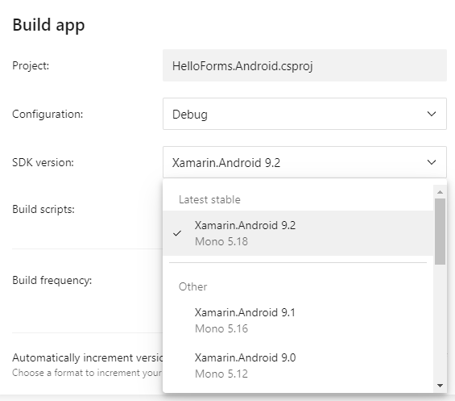

# boots


| Azure DevOps | App Center |
| --           | --         |
| [](https://jopepper.visualstudio.com/Jon%20Peppers%20OSS/_build/latest?definitionId=8&branchName=master) |  |

boots is a dotnet global tool for "bootstrapping" vsix & pkg files.

boots is useful for "pinning" a version of Mono, Xamarin, etc. when building projects on [Azure DevOps Hosted Agents](https://docs.microsoft.com/en-us/azure/devops/pipelines/agents/agents?view=azure-devops). You don't get to _choose_ what versions of things are installed on each agent, so it makes sense to install things yourself for reproducible builds. It also allows you to install preview versions of things (or more recent!) before they come available on the Hosted Agents.

## Use it

    dotnet tool install --global boots --version 0.1.0.251-beta
    boots https://url/to/your/package

boots currently supports Windows & Mac OSX, therefore:

* On Windows - assumes the file is a `.vsix` and installs it into all instances of Visual Studio via `VSIXInstaller.exe`.
* On Mac OSX - assumes the file is a `.pkg` and installs it

#### Use the Azure Pipeline Extension Task
Install the extension into your DevOps instance and add the task to a build or release, or use it from YAML:

```yaml
steps:
- task: Boots@0
  displayName: Install Xamarin.Android
  inputs:
    uri: https://aka.ms/xamarin-android-commercial-d16-2-windows
```
See the [Boots Task Extension Source](https://github.com/pjcollins/azure-web-extensions#use-in-your-yaml-pipeline) for more details.

## Some Examples

Install Mono, Xamarin.Android, and Xamarin.iOS on Mac OSX:

    boots https://download.mono-project.com/archive/6.0.0/macos-10-universal/MonoFramework-MDK-6.0.0.313.macos10.xamarin.universal.pkg
    boots https://aka.ms/xamarin-android-commercial-d16-2-macos
    boots https://bosstoragemirror.blob.core.windows.net/wrench/jenkins/xcode10.3/72cb587a39c12dfaa20cd5a0b1eb60a908ff88a6/1/package/xamarin.ios-12.14.0.113.pkg

Install Xamarin.Android on Windows:

    boots https://aka.ms/xamarin-android-commercial-d16-2-windows

I got each URL from:

* [Mono Downloads](https://www.mono-project.com/download/stable/#download-mac)
* [Xamarin.Android README](https://github.com/xamarin/xamarin-android)
* [Xamarin.iOS Github Status](https://github.com/xamarin/xamarin-macios/commits/d16-2)

To _upgrade_ .NET Core on Mac OSX, assuming you have some version of .NET Core to start with:

    boots https://download.visualstudio.microsoft.com/download/pr/1440e4a9-4e5f-4148-b8d2-8a2b3da4e622/d0c5cb2712e51c188200ea420d771c2f/dotnet-sdk-2.2.301-osx-x64.pkg

Url from: [.NET Core Downloads](https://dotnet.microsoft.com/download/dotnet-core/2.2). _NOTE: I used the Network tab in Chrome to find the final URL_.

### App Center

The `samples/HelloForms.sln` is a "Hello World" Xamarin.Forms project configured to build with boots installing newer versions than what is available:



See [`appcenter-post-clone.sh`](samples/HelloForms.Android/appcenter-post-clone.sh) in this repo for an example.

