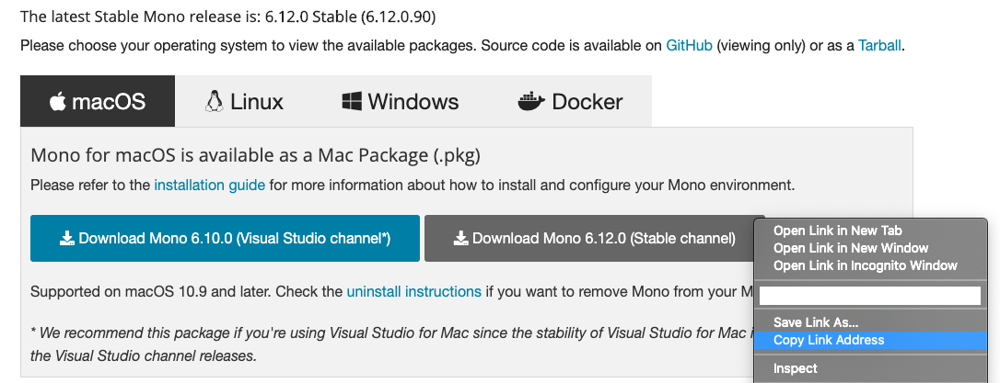
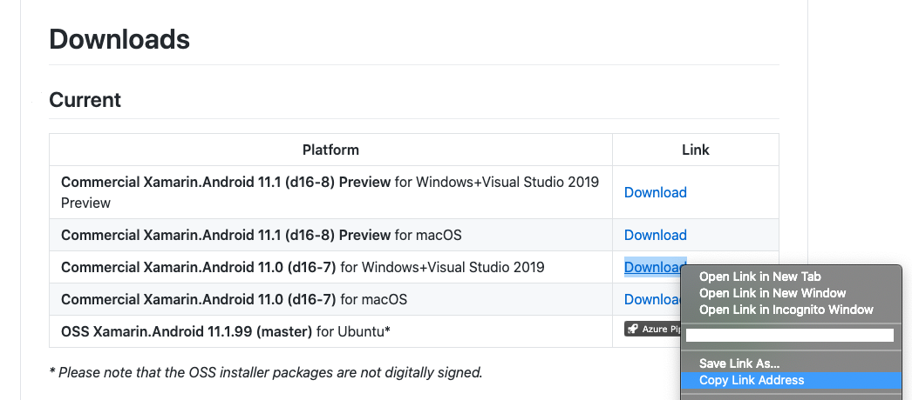
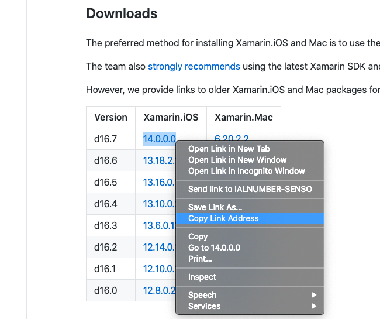

# How To Find Builds

Boots is all about specifying the version of Xamarin / Mono you want to use, but how do you find out about the available versions and where do you get them from?

## Latest Builds

To use the latest stable / preview builds you can simply use boots, by passing in the following arguments:

| Argument    | Description                     |
|-------------|---------------------------------|
| `--stable`  | Uses the latest stable version  |
| `--preview` | Uses the latest preview version |

```
boots --stable Mono
boots --stable Xamarin.Android
boots --stable Xamarin.iOS
boots --stable Xamarin.Mac
```

> Note: this feature is only availale for boots versions 1.0.2.X onwards


## Manual Builds

If you want to specify a specific version to use, you will have to find the specific package url that you wish to use. The package urls are different for every platform.

### Mono

The latest Mono version can be found on [Mono Downloads](https://www.mono-project.com/download/stable/). Head over to the page and copy the link address for the channel you wish to use:



The link should look similar to:

**Mono Version 6.12.0**

```
https://download.mono-project.com/archive/6.10.0/macos-10-universal/MonoFramework-MDK-6.10.0.104.macos10.xamarin.universal.pkg
```


### Xamarin.Android

To find the available Xamarin.Android versions you will need to head over to the official [Xamarin.Android repository](https://github.com/xamarin/xamarin-android). You can find the available versions in the [downloads](https://github.com/xamarin/xamarin-android#Downloads) section of the [README.md](https://github.com/xamarin/xamarin-android/blob/master/README.md).



The link should look similar to:

**Commercial Xamarin.Android 11.0 (d16-7) for Windows**

```
https://aka.ms/xamarin-android-commercial-d16-7-windows
```


### Xamarin.iOS & Xamarin.Mac

To find the available Xamarin.iOS / Xamarin.Mac versions you will need to head over to the official [Xamarin.iOS & Xamarin.Mac repository](https://github.com/xamarin/xamarin-macios). You can find the available versions in the [downloads](https://github.com/xamarin/xamarin-macios#downloads) section of the [README.md](https://github.com/xamarin/xamarin-macios/blob/main/README.md).



Select the version you wish to install & copy the link.

The link should look similar to:

**Xamarin.iOS d16.7**

```
https://download.visualstudio.microsoft.com/download/pr/c939bb72-556b-4e8a-a9b4-0f90e9b5e336/f906a6ce183fb73f1bcd945ac32f984b/xamarin.ios-14.0.0.0.pkg
```
